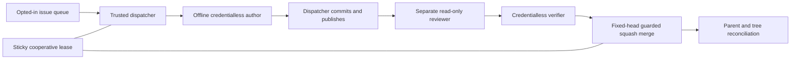

# Agentic Delivery Kit

A public-safe reference implementation extracted from a production agentic delivery setup. It demonstrates reusable control boundaries, not the original application's code, data, configuration, history, or operational records.

## Architecture



Only the trusted dispatcher has GitHub access. Model roles cannot commit, publish, change accounts, or deploy. The author edits a dedicated worktree. A fresh read-only role reviews exact head and base commits and specifies checks. A separate verifier executes those checks without general host credentials or tool networking. The dispatcher validates structured evidence, current issue eligibility, the PR head/base and remaining criteria before a head-pinned squash merge. It verifies the resulting parent and tree afterward.

The lease serializes cooperating local integration commands. It deliberately remains after failure. Queue claims and worker locks prevent duplicate local authors. Finite pass/phase/repair budgets, disk/file limits and bounded diagnostics constrain unattended work. These controls do not block independent remote writers.

## Configuration and safe start

Requires Python 3.11+, Git, the GitHub CLI, a compatible Codex CLI, and an HTTPS origin matching the configured repository. Runtime modules use only the standard library. Development checks use pytest and Ruff.

```sh
uv sync --group dev
uv run pytest -q
uv run ruff check .
python -m delivery_kit.dispatcher --config kit.toml
python -m delivery_kit.navigation --source examples/navigation --graph examples/navigation/graph.json --baseline examples/navigation/baseline.json
```

The default command validates configuration only. It does not contact GitHub or start model work. **Execution and timer installation are disabled by default.** Copy `kit.toml` to the ignored `local.toml` and configure the target checkout, repository owner/name, label policy, optional Project fields/options, names, state location, model/effort, worker count and limits. All deployment-specific settings belong in that one file. Secrets never belong there.

Before enabling, validate the installed CLI's named permission profile on a disposable checkout: tool networking denied, secret-file reads denied, author writes confined to its checkout, reviewer writes denied, Git metadata writes denied, user hooks/apps disabled, subprocess descendants terminated on timeout. The Codex inference broker still needs its own login and model connectivity. “Offline” describes tools and checks, not inference transport. `permissions_validated` is an explicit owner assertion, not a claim made by this package.

Only after this validation and an authorization covering the target repository's publishing and merging:

```sh
python -m delivery_kit.dispatcher --config local.toml --worker 1 --execute
python -m delivery_kit.launch --config local.toml --render state/timers
# macOS only, explicitly changes the user's LaunchAgent configuration:
python -m delivery_kit.launch --config local.toml --install
```

Add the configured opt-in label only to fully specified, authorized tasks. Holds, unresolved prerequisites, ambiguous metadata, existing ownership, failed checks, stale heads/bases, and incomplete criteria stop delivery. [Delivery policy](docs/delivery.md) explains recovery and limitations. [Navigation evaluation](docs/navigation.md) explains source-grounded trust measurement and adapters.

## Limitations

- Timer installation is macOS LaunchAgent-specific. Tests are credentialless and synthetic, not evidence of a live Codex/GitHub delivery.
- CLI permission interfaces evolve. No compatibility fallback disables isolation. Validate the installed release before enabling.
- Native dependency API or Project access failures stop selection. Project fields are read-only and their CLI JSON names must match configured display field names.
- This intentionally smaller reference leaves Issue closing, Project mutations, automatic rebases, notifications and worktree cleanup to explicit owner actions.
- Models can misjudge criteria or fabricate observations. Separate roles and source checks reduce risk but are not formal proof. Do not enable against untrusted repositories or issues requiring deployments, irreversible changes, private data or external messages.
- GitHub pins the merge head, not the base. A competing remote update can only be detected afterward. An unexpected parent/tree requires manual reconciliation, never automatic rollback.

See [Agentic Engineering](https://mg-mg-mg.github.io/agentic-engineering/) for the broader approach. See [SECURITY_REVIEW.md](SECURITY_REVIEW.md) for the actual checks and unverified boundaries of this extraction.
